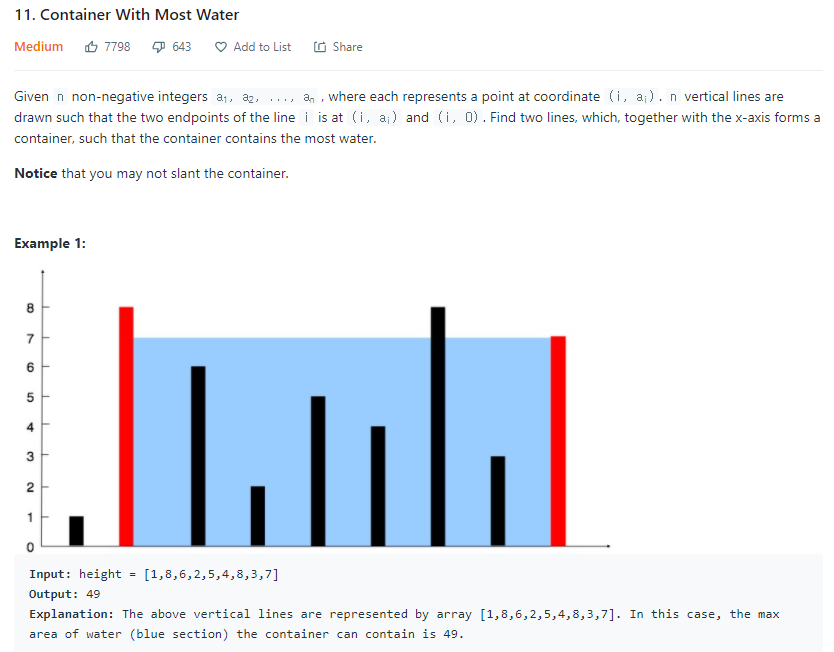
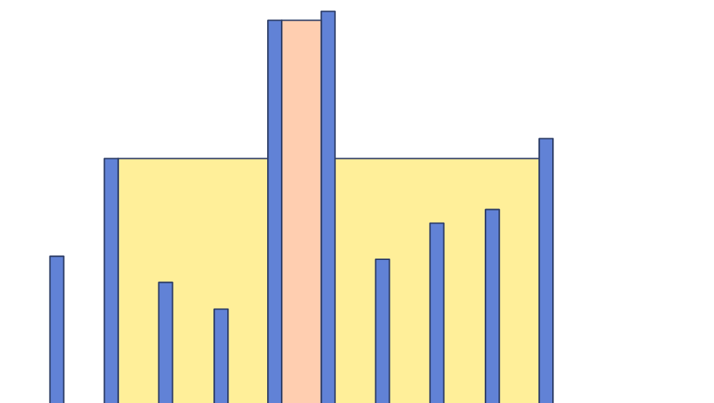

### Container With Most Water

- On(N)


##### 사용한 알고리즘

- Two Pointer


##### 풀이 로직

​	양 끝점에서 시작해서 범위를 좁히면서 최대 수용량을 갱신해준다!


##### 조건

1. 양 끝점을 움직일 때 최대 수용량을 얻기 위해선 더 높은 지점을 가만히 두고 낮은 지점의 위치를 이동시켜야한다.

2. 너비를 같이 신경써야한다.

   ex)

   

   노란색 > 빨간색


##### Code

```python
class Solution:
    def maxArea(self, height: List[int]) -> int:
        n = len(height)
        l,r = 0, n-1
        # 처음에 생각을 잘못해서 최소값을 갱신하고 시작했다.
        # 최댓값을 이용한 가지치기가 존재하지 않기때문에 ans = 0 으로 놓고 진행해도 된다.
        ans = min(height[l], height[r])*(n-1)
        while l <= r:
            dh = min(height[l],height[r])
            maxA = dh*(r-l)
            # 수용량 계산
            if ans < maxA:
                ans = maxA
            # 높은 부분을 두고 낮은 부분을 옮긴다.
            if height[l] > height[r]:
                r -= 1
            else:
                l += 1
        return ans
```


##### 어려웠던 점

- 유사한 문제를 풀었던 기억이 있어서 가장 큰 벽 두개를 찾아 계산했고 당연히 틀렸습니다가 떴다!
- 위의 유사한 문제를 풀때는 enumerate와 sort를 이용하여 계산했다.